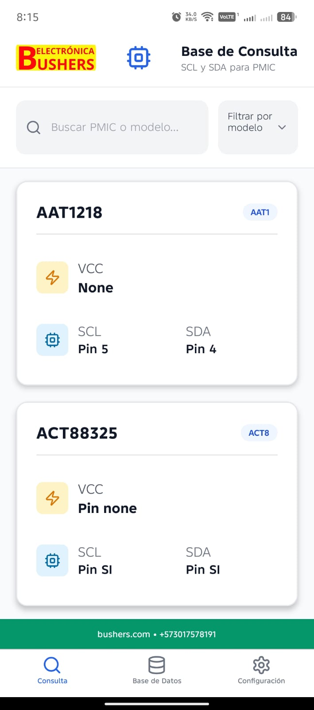
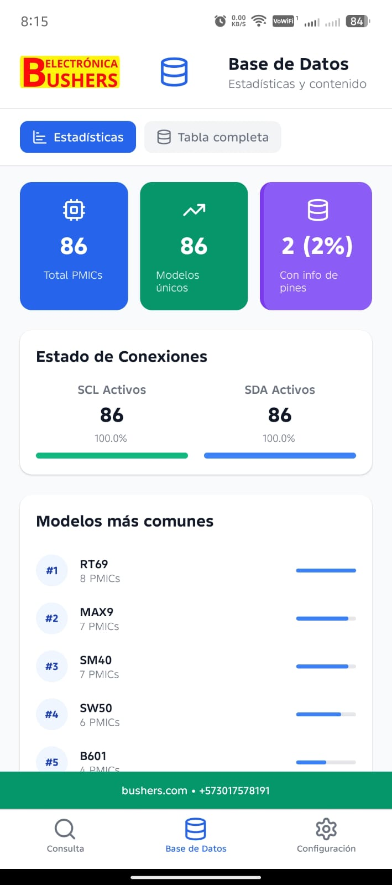
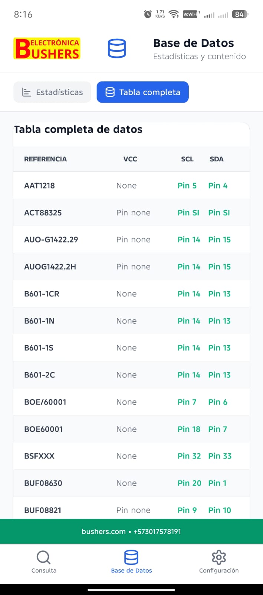
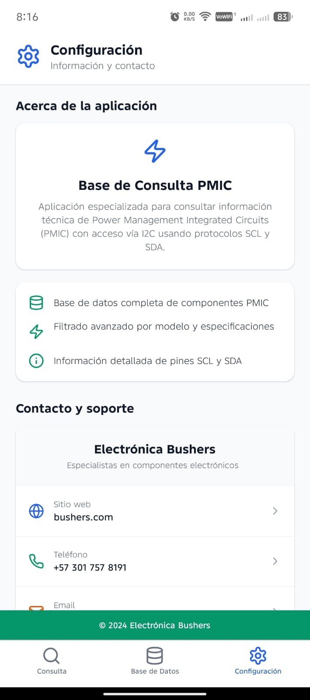

# app-pmic

Aplicación móvil desarrollada con React Native y Expo que proporciona funcionalidades para los usuarios de PMIC.

## ⬇️ Descargar APK

[](https://github.com/aestebang/app-pmic/releases/download/v1.0.0/APP.PMIC.10.apk)

> **Nota:** Asegúrate de tener habilitada la opción "Orígenes desconocidos" en la configuración de tu dispositivo Android para instalar aplicaciones fuera de Google Play Store.

## 🚀 Características

- Interfaz de usuario moderna y receptiva
- Navegación fluida con Expo Router
- Compatible con iOS y Android
- Diseño adaptativo para diferentes tamaños de pantalla
- Integración con funcionalidades nativas

## 📋 Requisitos Previos

- Node.js (v16 o superior)
- npm o yarn
- Expo CLI instalado globalmente (`npm install -g expo-cli`)
- Git
- Dispositivo móvil con la aplicación Expo Go o un emulador de Android/iOS

## 🛠 Instalación

1. Clona el repositorio:
   ```bash
   git clone https://github.com/aestebang/app-pmic.git
   cd app-pmic
   ```

2. Instala las dependencias:
   ```bash
   npm install
   # o
   yarn install
   ```

3. Inicia el servidor de desarrollo:
   ```bash
   npx expo start
   ```

4. Escanea el código QR con la aplicación Expo Go en tu dispositivo móvil o presiona:
   - `a` para abrir en un emulador de Android
   - `i` para abrir en un simulador de iOS
   - `w` para abrir en el navegador web

## 📸 Capturas de Pantalla

<div style="display: flex; flex-wrap: wrap; gap: 16px; justify-content: center;">
  
  
  
  
</div>

## 🏗 Estructura del Proyecto

```
app-pmic/
├── android/           # Configuración específica de Android
├── app/               # Directorio principal de la aplicación con Expo Router
│   └── (tabs)/        # Navegación por pestañas
├── assets/            # Recursos estáticos (imágenes, fuentes, etc.)
├── data/              # Datos y configuraciones
├── hooks/             # Custom hooks reutilizables
├── lib/               # Utilidades y lógica de negocio
├── node_modules/      # Dependencias
├── .gitignore
├── app.json           # Configuración de Expo
├── package.json       # Dependencias y scripts
└── tsconfig.json      # Configuración de TypeScript
```

## 🚦 Scripts Disponibles

- `expo start`: Inicia el servidor de desarrollo
- `expo run:android`: Ejecuta la aplicación en Android
- `expo run:ios`: Ejecuta la aplicación en iOS (solo macOS)
- `expo build:android`: Crea un APK/AAB para Android
- `expo build:ios`: Crea un IPA para iOS (solo macOS)


## 📱 Plataformas Soportadas

- Android 5.0+ (API 21+)
- iOS 13.0+
- Web (con limitaciones)


## 📄 Licencia

Este proyecto está bajo la Licencia [MIT](LICENSE).


